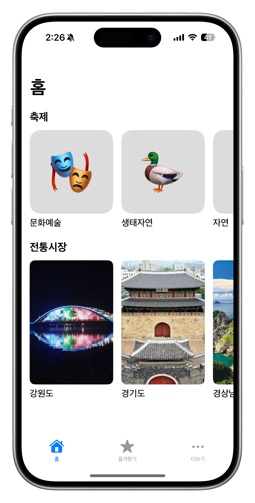
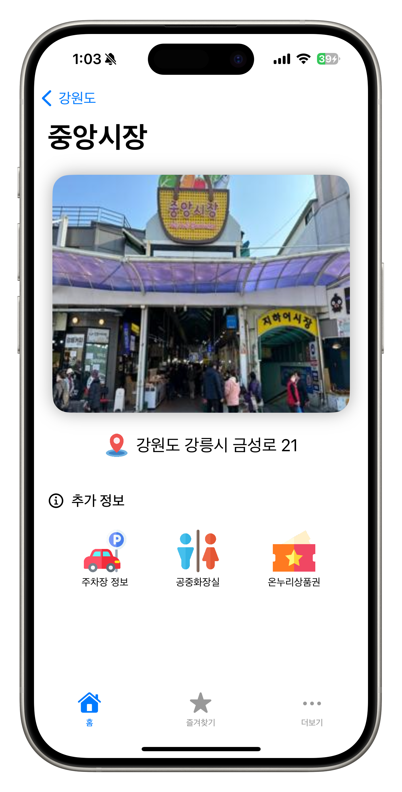
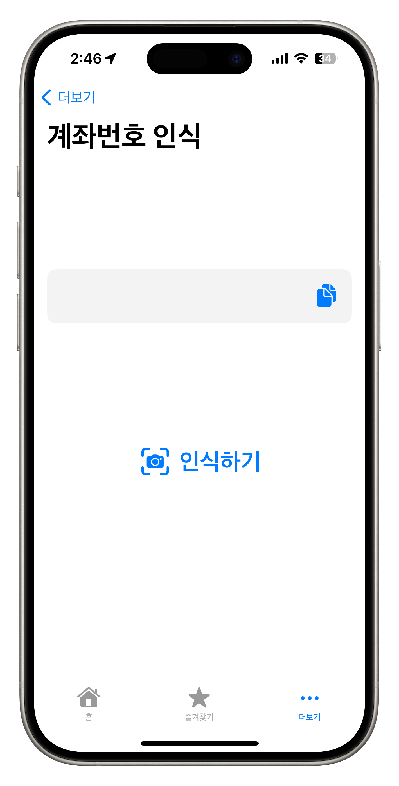
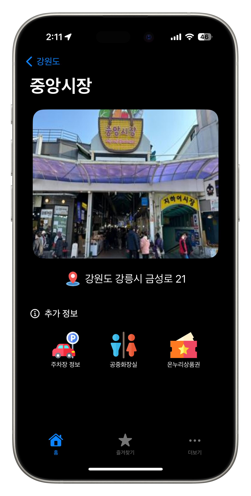
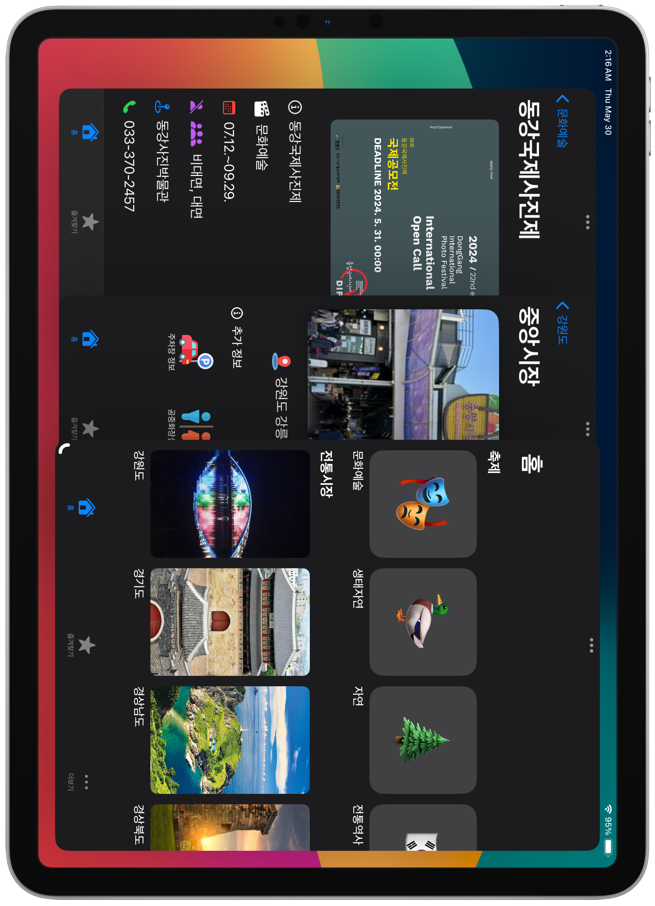

# Markets
Markets는 전통시장과 지역축제 데이터를 보여주는 iOS와 iPadOS용 클라이언트 앱이다.

## Folder Structure
* **Markets**: Markets의 iOS 및 iPadOS 앱 소스코드
    * **App**: 앱 내부의 UI와 로직에 대한 소스코드
    * **FirebaseModel**: Firebase Realtime Database와 Storage에서 데이터를 가져오는 코드
    * **Assets.xcassets**: 사진, 아이콘 등의 파일을 포함
* **Markets.xcodeproj** : Markets의 Xcode 프로젝트 폴더
* **assets**: GitHub readme를 위한 스크린샷 폴더

## Features
- 지역 축제와 전통시장에 대한 정보에 빠르게 접근
- Firebase Realtime Database와 연동하여 관리자가 내용 추가 및 변경 시 앱에도 즉시 반영
- Firebase Storage를 통한 시장 및 축제 이미지 제공
- MapKit을 활용하여 시장 위치와 현위치 확인 기능
- LiveText 기능을 활용한 계좌번호 인식 기능 및 클립보드에 복사
- 다크모드, 다이나믹 타입 등
- 아이패드 지원
    * 아이폰과는 다른 아이패드에 최적화 된 홈화면 디자인
    * 스플릿뷰, 스테이지 매니저 등의 멀티태스킹 방식 지원
    * 멀티태스킹 시 창 크기에 따라 변하는 UI

## App Screenshots

* 기본 홈 화면

* 전통시장 상세 내용 표시

* 계좌번호 인식 UI

* 다크모드 지원 UI

* 아이패드 지원